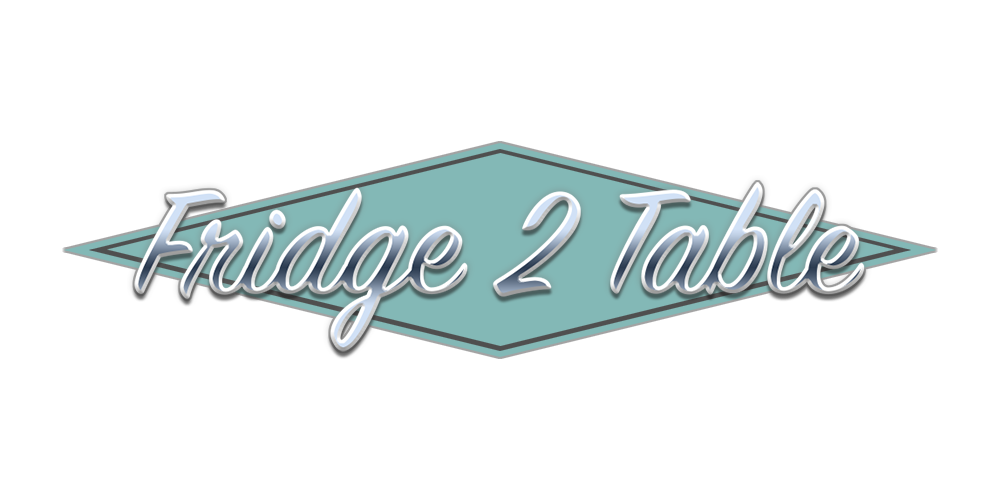
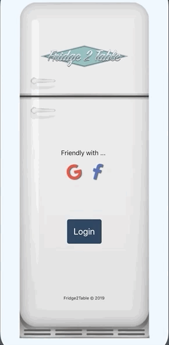
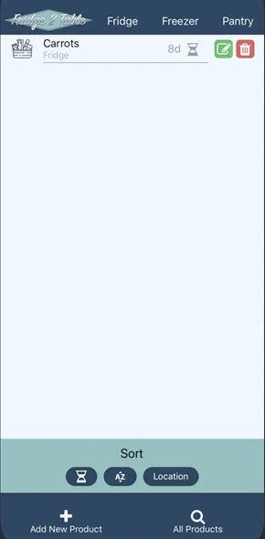
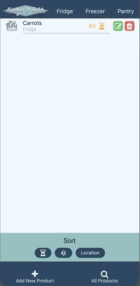
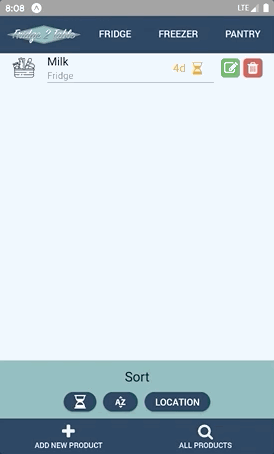

# Fridge2Table
The app that helps get your food fresh from your fridge to your table.

## Overview and Goals
Fridge2Table has one overarching goal - to make the modern problem of food management smooth and efficient. In achieving this goal, Fridge2Table will give users the ability to track their food wherever they store it with expiration dates and regular notifications if their food sits unused for too long. 

Every feature of our app has the singular goal of enhancing the food management experience for our users, and we intend to make that experience great.

## Deployment 
Our app will be deployed on Android through the Google Play store - [Fridge2Table Storefront](https://play.google.com/store/apps/details?id=com.dreamteamdesigns.fridge2table). The back end will be hosted on [MongoDB Atlas](https://www.mongodb.com/cloud/atlas), and our server will be hosted on [Heroku](https://www.heroku.com/). 

## MVP
* Have a login/signup page. 

* Track users and user data.
* Keep inventory of each user’s input food.
* Have multiple lists based on item location (fridge, freezer, pantry, etc.)
* Give users the ability to sort their inventory. Particularly by expiration date.
* Give users the ability to input and track their foods expiration dates.

* Give the users the ability to scan the items in via barcode, or to manually input them.

* Give users the ability to update the details on their food.

* Give users the ability to remove food.

* Notify users when their food is soon to expire.

## Dependencies
Our app will be using the following NPM:
* [Axios](https://www.npmjs.com/package/axios) - Our app will be making route calls with this NPM.
* [Auth0](https://auth0.com/) - We will have login and authentication for our users and for that we will be using Auth0.
* [Cron](https://www.npmjs.com/package/cron) - As part of our push notification functionality, and for some automated database management we will be using cron npm to schedule checks for expired food, and inactive users.
* [Dotenv](https://www.npmjs.com/package/dotenv) - We will use this NPM to keep our secrets safe.
* [Expo](https://expo.io/) - Our app will use Expo's native libraries to access the technology already present within the mobile device, such as the camera for scanning barcodes, and push notifications.
    * [Expo-server-sdk](https://github.com/expo/expo-server-sdk-node) - We will use Expo SDK to run on any native environment in which Expo is present.
    * [Expo Barcode](https://docs.expo.io/versions/latest/sdk/bar-code-scanner/) - Uses Expo to access the camera and read barcodes through the device's own functionality.
    * [Expo Push Notifications](https://docs.expo.io/versions/latest/guides/push-notifications/) - Uses Expo to access the device's push notification utility.
* [Express](https://www.npmjs.com/package/express) - We will be using Express to communicate between our back and front ends.
* [Firebase](https://firebase.google.com/) - We use Firebase Cloud Messaging to trigger expo's push notification API remotely via the project's credentials.
* [MongoDB](https://www.npmjs.com/package/mongodb) - Our database will be Mongo.
* [Mongoose](https://www.npmjs.com/package/mongoose) - We will be using the Mongoose ORM to manipulate our database.
* [React](https://reactjs.org/), [React Native](https://facebook.github.io/react-native/) - Our app is first and foremost a mobile React app, utilizing React Router for our pages, and React Native for our mobile structure.
  _As part of our React program we will be using the following tech_
  * [Native Base](https://nativebase.io/) - Component library for React Native.

## API
Our app will be using the following API:
* [Edamam](https://developer.edamam.com/) - Edamam will be our food and recipe API.

## Active Bugs and Issues
* The iOS date adding component resists being centered on the screen, and there is no submit button. This seems to be an issue primarily with the iOS.

## Future Features / Icebox
When looking to the future of "Fridge2Table," we want to furthur our goal of helping users manage their food from purchase to when they finally enjoy it at their table. When we think about this goal, there are clear avenues for expanding our app's functionality. With the following future features, our users will be able to make and store recipies, connect their favorite foods as ingredients to those recipies, and see which recipes they can make with the food thay have. If they're missing food from their home inventory, our users will be able to automatically or manually create shopping lists with new items and items populated from their inventory, past and present.
* Add multi-device push notification functionality. 
* A more in-depth informational modal for each food item that pops up when the user clicks the list item. This modal would include the full name, the expiration dates, a date-since- added counter, ingredients, and clear large buttons to access the multiple ways they can interact with the item.
* Add a CronJob to eliminate user's food data that haven't logged in within a year.
* Add a toggle button to the sort options that toggles between the expiration date and the daily counter data points. 
* A "Historic Inventory" list of all items they put into the inventory using the Edamam API.
* A grocery list, unique to each user, to which users can add new products, and products from their Historic inventory.
* Allow users to track how much of an item is left in servings matching those on the food label.
* Allow users to assign favorite products to an "ingredient" slot on a recipe.
* Make food-amount tracking automatic when combined with recipes.
* Give the user the ability to automatically add items to the grocery list based on what is missing from a recipe.
* Give users the ability to share their recipes.
* Submit to the Apple App store for iOS deployment.
* A website version of the app.
* Track user meta-data, and include ways to display it.
  * How often certain items go expired without being used.
  * How much, or how often certain items are purchased by the user.
* Track and display item meta data:
  * Are there items that tend to go expired earlier than their expiration date for most users?
* Give the users the ability to add a ripeness or freshness quality to their produce.
* Give the user an expiration window for fresh produce.

## Developed by DreamTeamDesigns
* Benjamin Harris - (Project Manager) - [Portfolio](https://dreadpipe.github.io/v2) | [Github Repository](https://github.com/Dreadpipe)
* Edward Cheever (Database Manager) - [Portfolio](https://edwardcheever.herokuapp.com/) | [Github Repository](https://github.com/Druidan)
* Geoff George - (Authentication Lead) [Portfolio](http://www.geoffdgeorge.com/) | [Github Repository](https://github.com/geoffdgeorge)
* Robert Hardin - (Research Monkey) - [Portfolio](https://rhardin94.github.io/) | [Github Repository](https://github.com/Rhardin94)